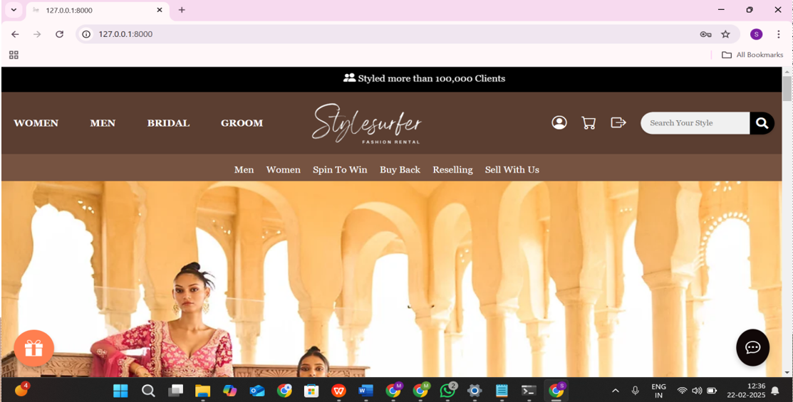
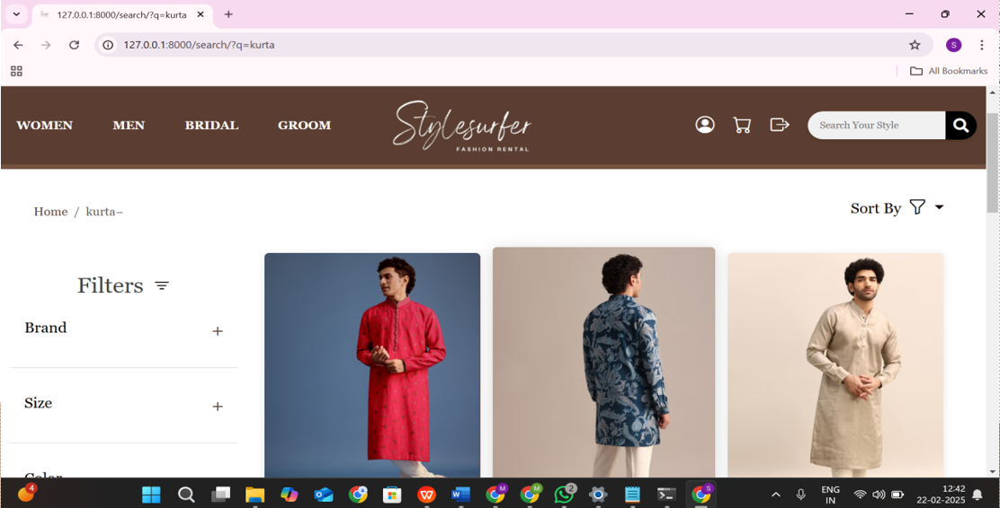
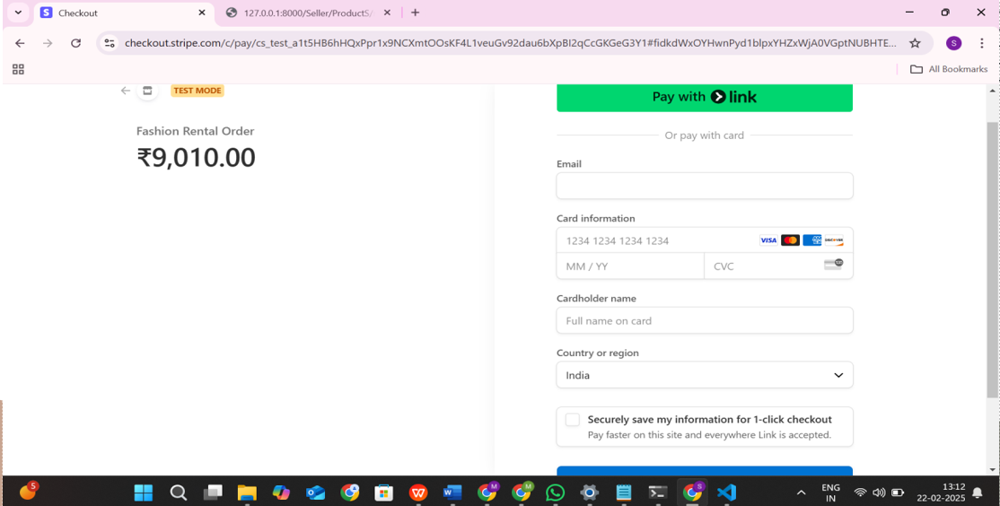
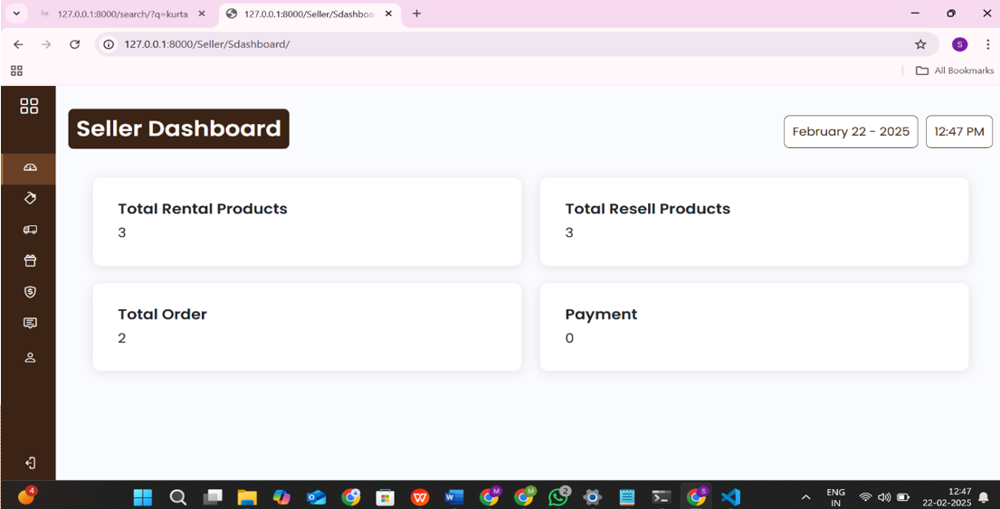
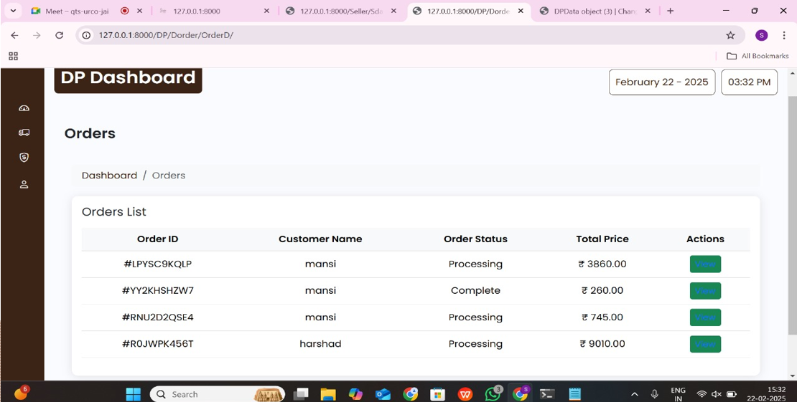
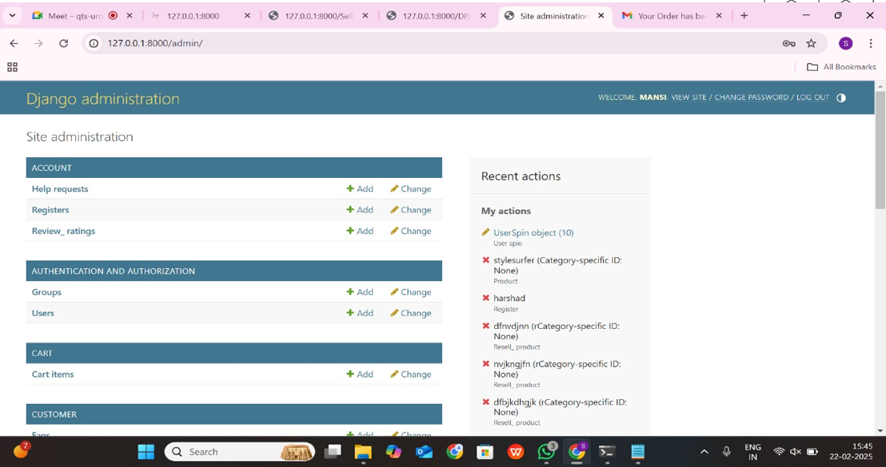

# StyleSurfer
### Sustainable Fashion Rental & Resale Platform

> Transforming fashion accessibility through rentals, resale, customization, and smart digital experiences.

---

---

## ✦ Overview

StyleSurfer is a full-stack fashion rental ecosystem designed to make premium fashion affordable, reusable, and sustainable.

The platform enables users to rent outfits, purchase resold garments, customize clothing through buy-back workflows, and enjoy an interactive shopping experience through a modern multi-role architecture.

Built with scalability, usability, and sustainability in mind, StyleSurfer combines fashion and technology into a unified digital platform.

---

## ✦ Core Features

### Customer Module
- Outfit rental system
- Advanced product browsing & filtering
- Cart & checkout workflow
- Secure Stripe payment integration
- Order tracking & history
- Spin-to-Win reward system
- Buy-back customization requests
- Reselling marketplace

---

### Seller Module
- Product listing & management
- Rental inventory control
- Order management
- Resell product management
- Earnings & transaction handling

---

### Delivery Partner Module
- Delivery dashboard
- Pickup & return management
- Order status updates
- Delivery tracking workflow

---

### Admin Module
- User & seller management
- Product moderation
- Refund/dispute handling
- Platform monitoring dashboard

---

## ✦ Tech Stack

| Category | Technologies |
|---|---|
| Frontend | HTML, CSS, JavaScript, Bootstrap |
| Backend | Python, Django |
| Database | SQLite / MySQL |
| Payment Gateway | Stripe |
| Version Control | Git & GitHub |

---

## ✦ Live Demo

> Coming Soon

---

## ✦ Project Screenshots

### Home Page

### Product Page

### Checkout System

### Seller Dashboard

### Delivery Dashboard

### Admin Panel

---

## ✦ Unique Highlights

- Flexible rental durations
- Sustainable fashion ecosystem
- Reselling integrated into rental workflow
- Buy-back customization model
- Gamified shopping experience
- Multi-role enterprise architecture
- Fully responsive UI/UX

---

## ✦ System Design & Documentation

The project includes:
- Use Case Diagram
- ER Diagram
- DFD Level 0 / 1 / 2
- Activity Diagrams
- Sequence Diagrams
- Flowcharts
- Class Diagram
- Software Project Report

---

## ✦ Patent Publication

**Title:** Automated Clothing Rental Kiosk  
**Application No:** 202521070250
**Publication Date:** 08 August 2025  

Published in the Indian Patent Office Journal under Marwadi University.

---

## ✦ Achievements

- Patent Published by Government of India
- Presented at Project Fair 2025
- Recognized by Marwadi University IPR Cell

---

## ✦ Key Responsibilities

### Mansi Kadvani & Harshad Soyaliya
- Core backend development
- System architecture
- Multi-role workflow management
- Authentication & authorization
- Frontend-backend integration
- Database management
- Feature integration & testing

---

## ✦ Additional Team Contributions

| Member | Contribution |
|---|---|
| Purav Chauhan | Frontend UI development and responsive page design |
| Bhumika Kanzariya | Minor frontend development support and product image collection |
| Jay Kaneriya | Minor frontend development support and product image collection |

---

## ✦ Future Enhancements

- AR-based Virtual Try-On
- 360° Outfit Visualization
- Mobile Application (Android & iOS)
- AI-based Outfit Recommendation
- IoT-based Smart Rental Kiosk

---

## ✦ Project Vision

StyleSurfer aims to redefine fashion consumption by promoting affordability, sustainability, accessibility, and circular fashion practices through technology-driven solutions.

---

## ✦ Repository Goals

This repository demonstrates:
- Full-stack development
- Multi-role system architecture
- UI/UX implementation
- Real-world workflow management
- Sustainable business model integration

---

## ✦ Contributors

- Mansi Kadvani
- Harshad Soyaliya
- Purav Chauhan
- Bhumika Kanzariya
- Jay Kaneriya

---

## ✦ Contact

### Mansi Kadvani
B.Tech Computer Engineering  
Marwadi University  

GitHub: [MansiKadvani](https://github.com/MansiKadvani)  
LinkedIn: [Mansi Kadvani](https://www.linkedin.com/in/mansi-kadvani-583059318/)

---

  Built for sustainable fashion innovation.

